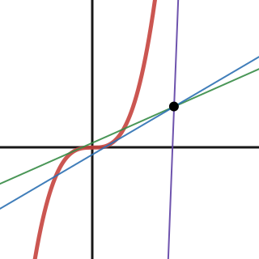

<h1 align="center">
   
  
   
  Tangent Equation Calculator
   
</h1>

<h4 align="center">Simple tool to calculate the tangent equation of a function.</h4>

  <a href="#features">Features</a> •
  <a href="#planned-features">Planned Features</a> •
  <a href="#running">Running</a> •
  <a href="#license">License</a>

## Features

* Calculate the tangent equation of a function at a point
* Point can be on or external to the function
* Compute complex relationships using implicit differentiation
* Exact and decimal output
* Supports vertical lines

## Planned Features

* Web app

## Running

1. Clone this project.
2. Run `finder.py` with Python 3.
3. Enter the function, point, and output type.

## License

This project is licensed under the [GNU General Public License v3.0](LICENSE).
